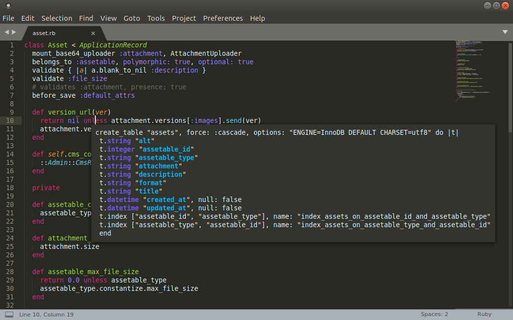
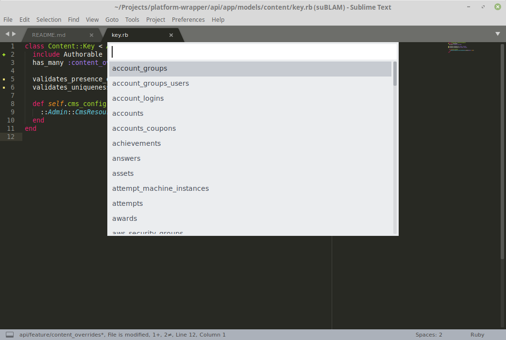

# suBLAM

Schema on demand! Show the corresponding DB schema code from inside the model, spec or factory file!

Science!





## Installation

Symlink suBLAM.py into your sublime packages directory:

```bash
cd /this/repo/dir
ln -s `pwd`/suBLAM.py $HOME/.config/sublime-text-3/Packages/User/suBLAM.py
```

Go to *Preferences->KeyBindings* and add a user keyboard shortcut to show the
schema. Something like:

```
{ "keys": ["ctrl+alt+s"], "command": "rails_schema" }
{ "keys": ["ctrl+alt+x"], "command": "rails_select_table" }
```
